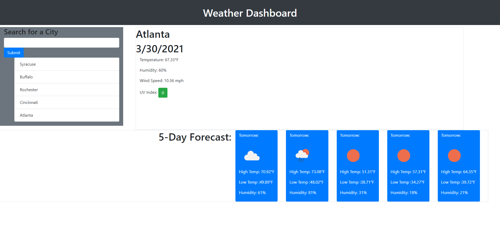

# weather-dashboard
# Decription
This is the finalized weather dashboard. The user can input a city name and be given current and future weather conditions for the chosen city, including temperature, humidity, wind speed, and UV index. The UV index will change colors based on the intensity. Furthermore, users searched cities are stored underneath the search bar and, if clicked on, will render to the page the weather data for that city.

# Deployed Site
Here is the link to the deployed site.

[Deployed Site](https://shrwnwilliams.github.io/weather-dashboard/)